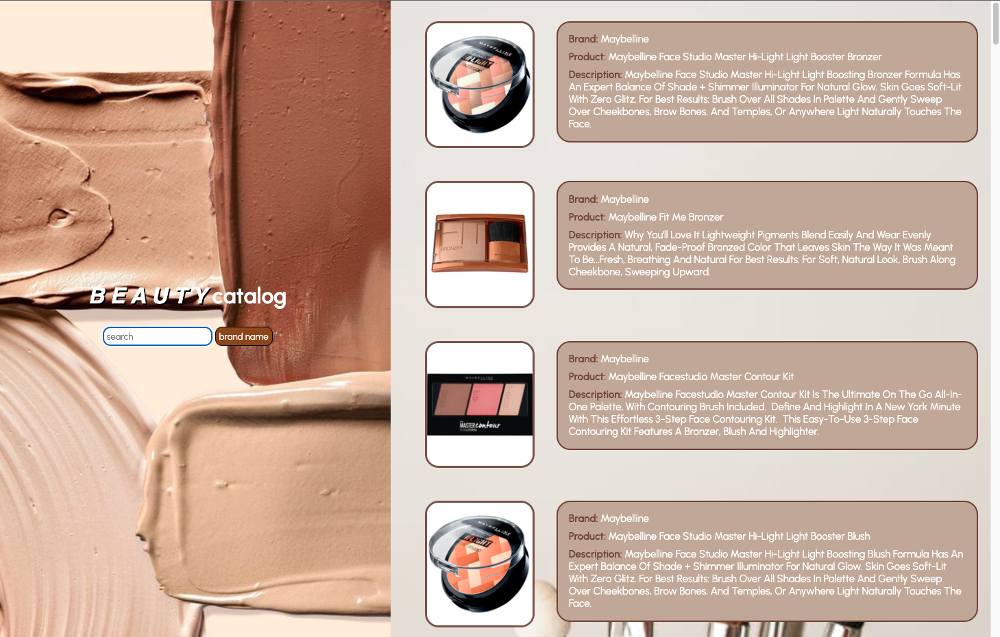

# Beauty Catalog
by Susie Gordon

</br>

### **Project Overview**

---

Beauty Catalog is an interactive application that allows the user to search for makeup products based on the brand name. The results will provide a list of products along with corresponding information about their intended uses.

</br>

### **Deployed App** 

---

[Click here](https://project-1-fawn.vercel.app/) to use the app!

</br>

### **API Description**

---

Makeup API provides an extensive range of makeup products with individual descriptions.


</br>

### **Technologies Used**

---

- HTML
- CSS
- JavaScript
- jQuery
- Makeup API
- Google Fonts

</br>

### **Installation** 

---

- `Fork` and `clone` this repository
- `cd` into the directory on your local machine
- Open this repository in your code editor and run `index.html` to open the website in your browser

</br>

### **API Call Method**

---

```js

$.ajax('url')
.then(() => {})

```

</br>

### **Mockup & Screenshot**

---

Mockup


</br>

Final Result



</br>

### **Difficulties & Problem Solving**

---

**Problem 1:** 
Rendering a placeholder image for broken images provided by the API. 
</br>
**Solution 1:** 
Utilized the `onerror` event to overhaul errors provided by the API. This case specifically corrects broken images by replacing them with another chosen image.

**Problem 2:** 
Creating the app to be responsive.
</br>
**Solution 2:**
Applied media query properties to targeted elements and adjusted them to desired settings. 

</br>

### **Daily Schedule**

---

|  Day  |  Task  |
|-------|--------|
| 1 | Setup Basic Project |
| 2 | Make API call |
| 3 | Render data to the page |
| 4 | Add user interactivity (form) |
| 5 | Styling |

</br>

### **Resources**

---

- [Class Bonus Cheatsheets](https://git.generalassemb.ly/AlexMerced/orientation/blob/master/cheatsheet/readme.md) 
- [Mozilla Developer Network (MDN)](https://developer.mozilla.org/)
- [W3 Schools](https://www.w3schools.com/)