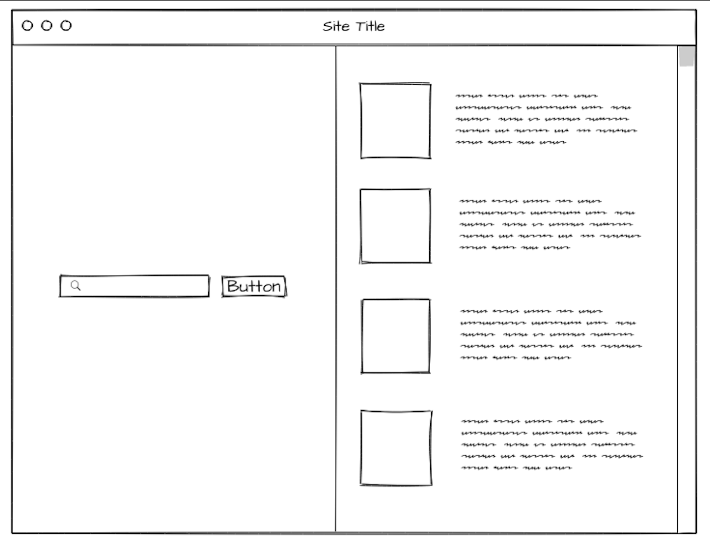

# Project 1
by Susie Gordon

### **Project Description**
This is an interactive application that provides a list of makeup products with their description based on the user's search by a specific name brand or product type.

### **API Description**
Makeup API provides an extensive range of makeup products with individual descriptions and their intended uses.

-Example code of you testing it

### **Technologies Used**
-HTML
-CSS
-JavaScript
-jQuery
-Google Fonts

```js

$.ajax(url)
.then(doTheThings)

```

### **Mockup**




### **Details about Difficulties**


### **Daily Schedule**

|  Day  |  Task  |
|-------|--------|
| 1 | Setup Basic Project |
| 2 | Make API call |
| 3 | Render data to the page |
| 4 | Add user interactivity (form) |
| 5 | Styling |
